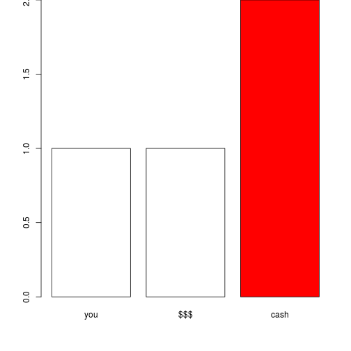

## Why?

1. How do you explain spam detection to non-technical staff and managers?
2. Why will they choose our products ahead of our competitors?
3. Why not use a fun and engaging application allowing potential customers to experiment and understand how a simple idea such as string frequency can be used to create spam filters?

---

## How does it work?

1. eString uses the "r"" progamming language and "shiny"" to create a simple and interactive string frequency analysis application
2. R is the professional statisticians tool of choice for creating complex statistical applications
3. Shiny allows a developer to create an interactive wrapper including info graphics so any user can experiment with "r"" programs through a simple html interface
4. Frequency Analysis in R + Interactive Wrapper in Shiny = eString

---

```
Technical Demo - Simplified Code
```

```r
library(stringr);email <- "you earn cash $$$ with cash";str <- c("you","$$$","cash")
cstr <- c(str_count(email, str[1]),str_count(email, str[2]),str_count(email, str[3]))
par(mar=c(5.1,4.1,0,2.1));barplot(cstr,names.arg=strings,col=c(0,0,10))
```



---

## How can it be used?

1. eString could be used as part if a presentation and/or embedded into our company's website
2. What better way to get customers to choose us than to allow them to understand our ideas through there own experimentation?


